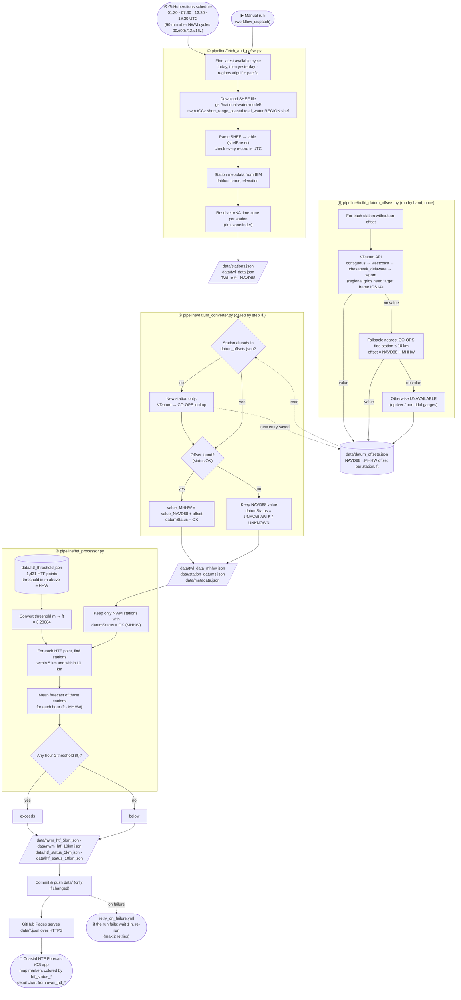

# Coastal TWL Forecast

This repo is the automated data pipeline behind the **Coastal HTF Forecast** iOS app. Every 6 hours it:

1. **Downloads** NOAA National Water Model (NWM) short-range coastal Total Water Level (TWL) forecasts.
2. **Converts** them from the NAVD88 datum to MHHW (Mean Higher High Water).
3. **Compares** them with 1,431 High Tide Flooding (HTF) thresholds along the US coast.
4. **Publishes** the results as JSON files on GitHub Pages for the app.

---

## Workflow flowchart



The chart shows the path from NOAA's model output to the app:
- **Solid arrows** are the 6-hour run.
- **Dotted arrows** read from or write to the one-time datum-offset table.

---

## Step by step, with units

### ⓪ One-time: build the NAVD88 → MHHW offset table

`pipeline/build_datum_offsets.py` is run by hand, not by the schedule:

```bash
python pipeline/build_datum_offsets.py          # fill in missing / failed stations
python pipeline/build_datum_offsets.py --all    # recompute every station
```

For each NWM station the script tries three things in order:

1. **[NOAA VDatum API](https://vdatum.noaa.gov/docs/services.html).**
   - VDatum covers the lower 48 with a general `contiguous` grid plus three regional tidal grids: `westcoast`, `chesapeak_delaware` and `wgom` (western Gulf).
   - The regional grids only answer when the target horizontal frame is `IGS14`, so each region is asked with the frame it accepts.
   - The table records which region produced the offset.
2. **Fallback: nearest NOAA CO-OPS tide station** within 10 km that publishes both NAVD88 and MHHW ([CO-OPS Metadata API](https://api.tidesandcurrents.noaa.gov/mdapi/prod/)).
   - The offset is `NAVD88 − MHHW`.
   - The station ID and distance are recorded.
3. **Otherwise `UNAVAILABLE`.** These are typically gauges far up rivers or in non-tidal marshes, where MHHW is not defined. Such stations are never compared with HTF thresholds.

Results are saved to `data/datum_offsets.json`. As of Sep 2026:

| Source of the offset | Stations |
|---|---|
| VDatum (contiguous grid, plus regional grids for 162 stations) | 370 |
| CO-OPS tide station fallback | 21 |
| Unavailable | 87 |
| **Total with an offset** | **391 of 478** |

### ① Download and parse the forecast — `fetch_and_parse.py`

- **Schedule:** runs at 01:30, 07:30, 13:30 and 19:30 UTC, 90 minutes after each NWM cycle.
- **Which cycle:** the newest cycle available today; if none, yesterday's.
- **Regions:** `atlgulf` and `pacific`.
- **Source file:** `gs://national-water-model/nwm.YYYYMMDD/…/nwm.tCCz.short_range_coastal.total_water.REGION.shef`
- **Parsing:** the SHEF file is parsed with `shefParser`. The script checks that every record carries the UTC time-zone code, because a silent switch to local time would shift every timestamp.
- **Station metadata:** matched from the [Iowa Environmental Mesonet](https://mesonet.agron.iastate.edu/sites/networks.php).
- **Time zones:** each station's IANA time zone (e.g. `America/New_York`) is added so the app can show local times.
- **Forecast length:** 18 hourly values per station, valid from cycle hour +1 to +18.

### ② Convert NAVD88 → MHHW — `datum_converter.py`

This step is called from step ①.

- **Converted stations:** for each station with an offset, `value_MHHW = value_NAVD88 + offset`.
- **Unconverted stations:** stations without an offset keep their NAVD88 value, flagged with `datumStatus` = `UNAVAILABLE` or `UNKNOWN`. `UNKNOWN` means the station has no coordinates in IEM.
- **Lookups:** only brand-new stations are looked up. Earlier failures are not retried here; re-run step ⓪ for that.

### ③ Compare with HTF thresholds — `htf_processor.py`

1. **Load thresholds.** `data/htf_threshold.json` holds 1,431 HTF points in **meters above MHHW**, from [Mahmoudi et al., 2024, *Nature Communications*](https://doi.org/10.1038/s41467-024-48545-1).
2. **Convert units.** Thresholds are converted to **feet**: × 3.28084.
3. **Filter stations.** Only NWM stations whose TWL was converted to MHHW (`datumStatus` = `OK`) are used.
4. **Find neighbors.** For each HTF point, the script finds those stations within **5 km** and within **10 km**, using great-circle distance.
5. **Average.** It averages the neighbors' forecasts hour by hour.
6. **Classify.** The point is `exceeds` if the mean forecast reaches the threshold in **any** of the 18 hours; otherwise `below`.
7. **Missing points.** HTF points with no converted station in range are left out; the app shows them as "no data".

### ④ Publish

- **Commit:** changed files in `data/` are committed by the "TWL Pipeline Bot".
- **Serve:** GitHub Pages serves them.
- **Retry:** if a run fails, `retry_on_failure.yml` waits one hour and re-runs it, at most twice.

---

## Units at every step

| Step | Quantity | Unit | Vertical datum | Where |
|---|---|---|---|---|
| ① | NWM total water level (raw) | **feet** | **NAVD88** | SHEF file → `twl_data.json` `value` |
| ① | Forecast times (`validTime`, `creationTime`) | ISO 8601, **UTC** | — | `twl_data.json`, `twl_data_mhhw.json` |
| ① | Station latitude / longitude | decimal degrees (west negative) | NAD83 | `stations.json` |
| ① | Station elevation | **meters** (as reported by IEM) | — | `stations.json` `elevation` |
| ① | Station time zone | IANA name, e.g. `America/Chicago` | — | `stations.json` `timeZone` |
| ⓪/② | NAVD88 → MHHW offset | **feet** (US survey feet from VDatum; CO-OPS "english" units) | MHHW − NAVD88 shift | `datum_offsets.json` `offset_ft` |
| ② | Converted total water level | **feet** | **MHHW** | `twl_data_mhhw.json` `value` (when `datumStatus` = `OK`) |
| ② | Original total water level | **feet** | **NAVD88** | `twl_data_mhhw.json` `valueNAVD88` |
| ③ | HTF threshold (source) | **meters** | above **MHHW** | `htf_threshold.json` `HTF MidThreshold`, `HTF Range` |
| ③ | HTF threshold (compared) | **feet** | above **MHHW** | `nwm_htf_*km.json` `htfMidThreshold`, `htfRangeFt` |
| ③ | HTF threshold (original, kept for reference) | **meters** | above **MHHW** | `nwm_htf_*km.json` `htfMidThresholdM`, `htfRange` |
| ③ | Mean forecast | **feet** | **MHHW** | `nwm_htf_*km.json` `meanForecast[].value` |
| ③ | Search radius and station distances | **kilometers** | — | `radiusKm`, `distance_km` |
| ③ | Status | `"exceeds"` / `"below"` | — | `htf_status_*km.json` |

> The difference between the US survey foot and the international foot is 2 parts per million, which is negligible here.

---

## Output files

| File | Contents |
|------|----------|
| `data/stations.json` | NWM station metadata: `id`, `name`, `latitude`, `longitude`, `elevation` (m), `network`, `timeZone` |
| `data/twl_data.json` | 18-hour TWL series per station, **feet NAVD88** |
| `data/twl_data_mhhw.json` | Same series with `value` in **feet MHHW** (when converted), `valueNAVD88`, and `datumStatus` |
| `data/datum_offsets.json` | One-time table of NAVD88→MHHW offsets (ft), with `status`, `method`, VDatum `region` or `coopsStation`, and `checked` date |
| `data/station_datums.json` | Per-station summary of the datum lookup used in this run |
| `data/htf_threshold.json` | 1,431 HTF points (meters above MHHW) |
| `data/nwm_htf_5km.json`, `data/nwm_htf_10km.json` | Per HTF point: threshold (ft and m), mean forecast (ft MHHW), matched and excluded stations, time zone |
| `data/htf_status_5km.json`, `data/htf_status_10km.json` | Per HTF point: `"exceeds"` or `"below"`. Small files, so the app can color map markers quickly. |
| `data/metadata.json` | Run info: time, cycle used, station counts, number of MHHW-converted stations |

## Data URLs (GitHub Pages)

- Stations: `https://ehsankahrizi.github.io/coastal-twl-app/data/stations.json`
- TWL Data (NAVD88): `https://ehsankahrizi.github.io/coastal-twl-app/data/twl_data.json`
- TWL Data (MHHW): `https://ehsankahrizi.github.io/coastal-twl-app/data/twl_data_mhhw.json`
- HTF results: `https://ehsankahrizi.github.io/coastal-twl-app/data/nwm_htf_5km.json` (also `_10km`)
- HTF status: `https://ehsankahrizi.github.io/coastal-twl-app/data/htf_status_5km.json` (also `_10km`)
- Metadata: `https://ehsankahrizi.github.io/coastal-twl-app/data/metadata.json`

## Data sources

- **TWL forecasts:** NOAA National Water Model, short-range coastal, via `gs://national-water-model/`
- **Station metadata:** [Iowa Environmental Mesonet (IEM)](https://mesonet.agron.iastate.edu/sites/networks.php)
- **Datum offsets:** [NOAA VDatum API](https://vdatum.noaa.gov/docs/services.html) (primary, including regional grids), [CO-OPS Metadata API](https://api.tidesandcurrents.noaa.gov/mdapi/prod/) (fallback, ≤ 10 km)
- **HTF thresholds:** [Mahmoudi, Moftakhari, Muñoz, Sweet & Moradkhani (2024), *Establishing flood thresholds for sea level rise impact communication*, Nature Communications](https://doi.org/10.1038/s41467-024-48545-1). Values are in meters above MHHW.
